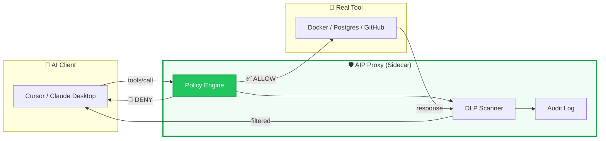
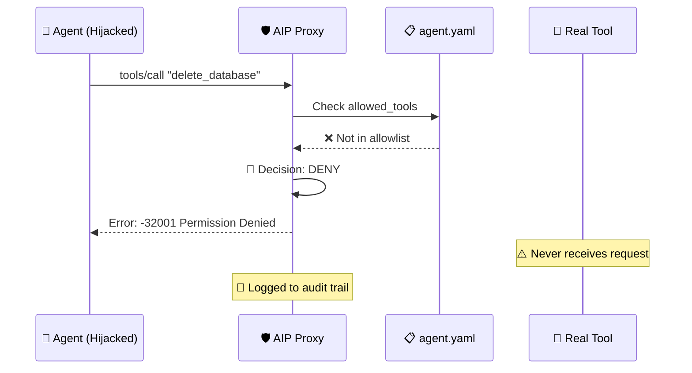

<p align="center">
  <h1 align="center">Agent Identity Protocol (AIP)</h1>
  <p align="center"><em>The Zero-Trust Identity Layer for MCP & Autonomous Agents</em></p>
</p>

<p align="center">
  <a href="https://goreportcard.com/report/github.com/ArangoGutierrez/agent-identity-protocol"></a>
  <a href="LICENSE"></a>
  <a href="https://github.com/ArangoGutierrez/agent-identity-protocol/actions/workflows/ci.yml"></a>
  <a href="https://securityscorecards.dev/viewer/?uri=github.com/ArangoGutierrez/agent-identity-protocol"></a>
  <a href="https://twitter.com/ArangoGutworker"></a>
  <a href="https://news.ycombinator.com/item?id=46695323"></a>
</p>

> **Implementations:** [Go](https://github.com/openagentidentityprotocol/aip-go) 

---
## What is AIP?

AIP (Agent Identity Protocol) is an open-source standard for **authentication, attestation, authorization, and governance of AI agents**. It's the IAM standard for AI. 

Today, agents are granted full permissions to API keys, secrets, and system resources, running *as* the user with no distinction between human and non-human actions. As the line between what a human and an autonomous agent does becomes increasingly blurred, this creates serious risks — not just at a security level, but at a **legal, societal, and economic level**.

AIP is being built and proposed to the [IETF](https://www.ietf.org) to provide a universal standard for identity in the **Internet of Agents (IoA)** — so that anyone, anywhere, can build secure agents and gain full visibility with confidence.


## The God Mode Problem


### Agents Have No Identity Layer

There is no universal way to distinguish an AI agent from a human actor. When you connect Claude, Cursor, or any MCP-compatible agent to your systems, it receives **god mode** — full access to every tool the server exposes, with the same credentials as the user.

**Model safety isn't enough.** Attacks like Indirect Prompt Injection — demonstrated by the [GeminiJack vulnerability](https://embrace-the-red.com/blog/gemini-jack/) — have proven that adversarial instructions embedded in documents, emails, or data can hijack agent behavior. The model *believes* it's following your intent while executing an attacker's commands.

Your agent is one poisoned PDF away from `rm -rf /`.

Beyond security, agents operating without identity creates systemic gaps:

- **No audit trail** — actions taken by agents are indistinguishable from human actions in logs
- **No revocation** — once an agent has credentials, there is no standard way to revoke them
- **No authorization granularity** — access is all-or-nothing at the API key level
- **Compliance blind spots** — SOC 2, GDPR, HIPAA, and SOX requirements are unmet for agentic actions

> ***"Authentication is for Users. AIP is for Agents."***
---

## How AIP Works

AIP is built on two layers that work together. **Layer 1 establishes who the agent is.** **Layer 2 decides what it's allowed to do.** The Agent Authentication Token (AAT) is the bridge. It's issued by Layer 1, enforced by Layer 2.

The current Go implementation of AIP introduces **policy-based authorization** at the tool-call layer—the missing security primitive between your agents and your infrastructure. Try it for yourself.

---

## Architecture Design

```
         LAYER 1 — IDENTITY                    LAYER 2 — ENFORCEMENT
         (Who is this agent?)                  (What can it do?)

┌─────────────────┐                       ┌─────────────────┐
│  Root Registry  │  (AIP Authority)      │   AI Client     │
│  Signs Agent    │                       │ Cursor / Claude │
│  Certificates   │                       └────────┬────────┘
└────────┬────────┘                                │ tool call + AAT
         │ Issues Attestation                      ▼
         ▼                                ┌─────────────────────────┐
┌─────────────────┐                       │       AIP Proxy         │
│ Agent Identity  │                       │                         │
│  (Public Key)   │                       │ 1. Verify AAT signature │◀── AIP Registry
└────────┬────────┘                       │ 2. Check token claims   │    (revocation)
         │ Signs Token Requests           │ 3. Evaluate policy      │
         ▼                                │ 4. DLP scan             │
┌─────────────────┐                       │ 5. Audit log            │
│  Token Issuer   │                       └────────┬────────────────┘
│  Validates ID   │      AAT                       │ ✅ ALLOW / 🔴 DENY
│  Issues AAT     │ ─────────────────────────────▶ │
└─────────────────┘                                ▼
                                          ┌─────────────────┐
                                          │   Real Tool     │
                                          │ Docker/Postgres │
                                          │ GitHub / etc.   │
                                          └─────────────────┘
```

**The AAT is what connects the two layers.** It carries signed claims about the agent — who issued its identity, which user it's acting on behalf of, what capabilities it declared, and when it was issued. The proxy in Layer 2 doesn't just check a static YAML allowlist — it verifies the cryptographic signature on the AAT, checks those claims against policy, and only then permits the tool call.

This means:
- A **hijacked agent** fails at Layer 2 — its AAT claims don't match the attempted action
- A **revoked agent** fails at Layer 2 — the proxy checks the registry revocation list on every call
- A **legitimate agent** passes through both layers with a full audit trail tied to its identity

## Current Architecture Implementation 

### Layer 1 — Agent Identity (Protocol) (IN PROGRESS)

AIP establishes cryptographic identities for AI agents. Before an agent can act, it obtains an AAT from the Token Issuer — a signed token tied to both the agent's key pair and the end-user's identity.

**Security model:**
- **Root of Trust** — AIP registry holds the issuer private key and signs agent certificates
- **Agent Key Pair** — each agent generates its own keys; the private key never leaves the agent
- **AAT Claims** — token encodes agent ID, user binding, capabilities, expiry, and issuer
- **Revocation** — registry maintains a revocation list checked by the proxy at runtime


### Layer 2 — Policy Enforcement (Runtime)

AIP also operates as a transparent proxy between the AI client (Cursor, Claude, VS Code) and the MCP tool server. Every tool call passes through the policy engine before reaching the real tool. Today the proxy enforces YAML-defined policy. As Layer 1 matures, policy decisions will be driven by claims inside the AAT itself — moving from static configuration to cryptographically-grounded authorization.




### Defense-in-Depth: Attack Blocked

When an injected prompt attempts to execute a dangerous operation, AIP intercepts and blocks it before the tool ever receives the request.



## Goals for what the proxy should do on every call

- Verifies the AAT signature against the AIP registry public key
- Checks token claims (agent ID, user binding, expiry) against policy
- Allows, denies, or escalates to a human based on the tool and arguments
- DLP-scans both the request and the response for sensitive data
- Writes an immutable audit log entry tied to the agent's verified identity


---

## Design Goals

- **Language Agnostic** — supports agents written in Python, JavaScript, Go, Java, Rust, and more
- **Zero Trust** — no implicit trust between agents or based on network location
- **Minimal Overhead** — fast token verification without centralized bottlenecks
- **Compliance Ready** — generates audit trails that satisfy SOC 2, GDPR, HIPAA, and SOX
- **Developer Friendly** — simple SDK integration that works locally without infrastructure

---

## Core Concepts

| Term | Definition |
| --- | --- |
| **Agent** | An autonomous AI system that makes decisions and performs actions |
| **Agent Identity Document (AID)** | JSON structure defining an agent's cryptographic identity |
| **Agent Authentication Token (AAT)** | A signed token proving agent identity at runtime |
| **Registry** | Central directory of registered agents, permissions, capabilities, and federation |
| **Token Issuer** | Service that generates and signs AATs |
| **Resource Server** | API or system that agents request access to |
| **Policy Engine** | Runtime component that evaluates every tool call against defined policy |

---

## Why AIP?

| Feature | Standard MCP | API Keys | AIP |
| --- | --- | --- | --- |
| **Agent Identity** | ⚠️ None | ⚠️ User-level only | ✅ Per-agent cryptographic identity |
| **Prompt Injection** | ⚠️ Vulnerable | ⚠️ Vulnerable | ✅ Policy blocks unauthorized intent |
| **Authorization Granularity** | ⚠️ All-or-nothing | ⚠️ Scope-level | ✅ Per-tool, per-argument validation |
| **Audit Trail** | ⚠️ None | ⚠️ Grant-time only | ✅ Immutable JSONL per action |
| **Human-in-the-Loop** | ⚠️ Not supported | ⚠️ Not supported | ✅ Native OS approval dialogs |
| **Revocation** | ⚠️ Rotate keys | ⚠️ Rotate keys | ✅ Registry revocation list |
| **Data Exfiltration** | ⚠️ Unrestricted | ⚠️ Unrestricted | ✅ DLP scanning + egress filtering |
| **Compliance** | ⚠️ Manual | ⚠️ Partial | ✅ SOC 2, GDPR, HIPAA, SOX ready |
---

## How is AIP Different?

### vs. Workforce AI Governance (e.g., SurePath.ai)

AIP and workforce AI governance tools solve different problems at different layers:

| Aspect | Workforce AI Governance | AIP |
|--------|------------------------|-----|
| **Focus** | Employee AI usage monitoring | Agent action authorization |
| **Layer** | Network/application level | Tool-call level |
| **Question** | "Who in my org is using AI?" | "What can my AI agents do?" |
| **Deployment** | Typically SaaS | Open protocol, self-hosted |
| **Use Case** | Audit employee ChatGPT usage | Block agent from deleting databases |

**These are complementary**: Use workforce governance to monitor employee AI usage. Use AIP to secure the agents those employees build.

### vs. OAuth / API Keys

| Aspect | OAuth | AIP |
|--------|-------|-----|
| **Granularity** | Scope-level ("repo access") | Action-level ("repos.get with org:X") |
| **Timing** | Grant-time | Runtime (every call) |
| **Audience** | End users | Developers/Security teams |
| **Format** | Token claims | YAML policy files |

**OAuth answers "who is this?"** — AIP answers **"should this specific action be allowed?"**

---

## See The Proxy In Action

When an agent attempts a dangerous operation, AIP blocks it immediately:

```json
{
  "jsonrpc": "2.0",
  "id": 1,
  "error": {
    "code": -32001,
    "message": "Permission Denied: Tool 'delete_database' is not allowed by policy"
  }
}
```

**What just happened?**
1. Agent (possibly hijacked by prompt injection) tries to call `delete_database`
2. AIP policy engine checks `allowed_tools` list
3. Tool not found → Request blocked before reaching your infrastructure
4. Attempt logged to audit trail for forensic analysis

**Your database never received the request.** This is zero-trust authorization in action.

---

## Quick Start

Secure any MCP tool server in one command:

```bash
# Secure your local Docker MCP
aip wrap docker --policy ./policies/read-only.yaml
```

Or protect your existing configuration:

```bash
# Start the AIP proxy with your policy
aip --target "python mcp_server.py" --policy ./agent.yaml

# Generate Cursor IDE configuration
aip --generate-cursor-config --policy ./agent.yaml --target "npx @mcp/server"
```

### Example Policy

```yaml
apiVersion: aip.io/v1alpha1
kind: AgentPolicy
metadata:
  name: secure-agent
spec:
  mode: enforce
  allowed_tools:
    - read_file
    - list_directory
    - git_status
  tool_rules:
    - tool: write_file
      action: ask        # Human approval required
    - tool: exec_command
      action: block      # Never allowed
  dlp:
    patterns:
      - name: "AWS Key"
        regex: "AKIA[A-Z0-9]{16}"
```

---

## Roadmap

We're building a **standard**, not just a tool.

- [x] **v0.1: Localhost Proxy** — The *"Little Snitch"* for AI Agents
  - Tool allowlist enforcement
  - Argument validation with regex
  - Human-in-the-Loop (macOS, Linux)
  - DLP output scanning
  - JSONL audit logging
  - Monitor mode

- [ ] **v0.2: Kubernetes Sidecar** — The *"Istio"* for AI Agents
  - Helm chart
  - NetworkPolicy integration
  - Prometheus metrics

- [ ] **v1.0: OIDC / SPIFFE Federation** — Enterprise Identity
  - Workload identity federation
  - Centralized policy management
  - Multi-tenant audit aggregation

---

## Documentation

| Resource | Description |
|----------|-------------|
| [AIP Specification](spec/aip-v1alpha1.md) | Formal protocol definition (v1alpha1) |
| [Policy Reference](docs/policy-reference.md) | Complete YAML schema |
| [Go Proxy README](implementations/go-proxy/README.md) | Reference implementation |
| [Quickstart Guide](implementations/go-proxy/docs/quickstart.md) | 5-minute tutorial |
| [Why AIP?](docs/why-aip.md) | Threat model and design rationale |
| [FAQ](docs/faq.md) | Common questions |

---

## SDKs & Implementations

| Language | Repository | Status |
| --- | --- | --- |
| **Go** | [aip-go](https://github.com/openagentidentityprotocol/aip-go) | ✅ Stable |
| **Rust** | [aip-rust](https://github.com/openagentidentityprotocol/aip-rust) | 🚧 Coming Soon |

Want to build an AIP implementation in another language? See [CONTRIBUTING.md](./CONTRIBUTING.md).


## Contributing

AIP is an open specification. We welcome:

- **Protocol feedback** — Issues and PRs to the spec
- **New implementations** — Build AIP in Rust, TypeScript, Python
- **Security research** — Threat modeling, attack surface analysis
- **Documentation** — Tutorials, examples, integrations

See [CONTRIBUTING.md](CONTRIBUTING.md) for guidelines.

---

## License

**Apache 2.0** — See [LICENSE](LICENSE)

Enterprise-friendly. Use it, fork it, build on it.

---

## Security

For vulnerability reports, see [SECURITY.md](SECURITY.md).

---

<p align="center">
  <strong>Stop trusting your agents. Start verifying them.</strong>
</p>
