<p align="center">
  <h1 align="center">Agent Identity Protocol (AIP)</h1>
  <p align="center"><em>The Zero-Trust Identity Layer for MCP & Autonomous Agents</em></p>
</p>

<p align="center">
  <a href="https://goreportcard.com/report/github.com/ArangoGutierrez/agent-identity-protocol"></a>
  <a href="LICENSE"></a>
  <a href="https://github.com/ArangoGutierrez/agent-identity-protocol/actions/workflows/ci.yml"></a>
  <a href="https://securityscorecards.dev/viewer/?uri=github.com/ArangoGutierrez/agent-identity-protocol"></a>
  <a href="https://twitter.com/ArangoGutworker"></a>
  <a href="https://news.ycombinator.com/item?id=46695323"></a>
</p>

> **Implementations:** [Go](https://github.com/openagentidentityprotocol/aip-go) 

---

## The God Mode Problem

Today's AI agents operate with **unrestricted access** to your infrastructure. When you connect Claude, Cursor, or any MCP-compatible agent to your systems, it receives *god mode*—full access to every tool the server exposes.

**Model safety isn't enough.** Attacks like **Indirect Prompt Injection**—demonstrated by the [GeminiJack vulnerability](https://embrace-the-red.com/blog/gemini-jack/)—have proven that adversarial instructions embedded in documents, emails, or data can hijack agent behavior. The model *believes* it's following your intent while executing the attacker's commands.

Your agent is one poisoned PDF away from `rm -rf /`.

> ***"Authentication is for Users. AIP is for Agents."***

AIP introduces **policy-based authorization** at the tool-call layer—the missing security primitive between your agents and your infrastructure.

---

## Architecture

### High-Level Flow

AIP operates as a transparent proxy between the AI client (Cursor, Claude, VS Code) and the MCP tool server. Every tool call passes through the policy engine before reaching the real tool.



```mermaid
graph LR
    subgraph Client["🤖 AI Client"]
        A[Cursor / Claude Desktop]
    end
    
    subgraph AIP["🛡️ AIP Proxy (Sidecar)"]
        B[Policy Engine]
        C[DLP Scanner]
        D[Audit Log]
    end
    
    subgraph Server["🔧 Real Tool"]
        E[Docker / Postgres / GitHub]
    end
    
    A -->|"tools/call"| B
    B -->|"✅ ALLOW"| E
    B -->|"🔴 DENY"| A
    B --> C
    C --> D
    E -->|"response"| C
    C -->|"filtered"| A
    
    style B fill:#22c55e,stroke:#16a34a,stroke-width:2px,color:#fff
    style AIP fill:#f0fdf4,stroke:#16a34a,stroke-width:3px
```

### Defense-in-Depth: Attack Blocked

When an injected prompt attempts to execute a dangerous operation, AIP intercepts and blocks it before the tool ever receives the request.

```mermaid
sequenceDiagram
    participant Agent as 🤖 Agent (Hijacked)
    participant AIP as 🛡️ AIP Proxy
    participant Policy as 📋 agent.yaml
    participant Tool as 🔧 Real Tool

    Agent->>AIP: tools/call "delete_database"
    AIP->>Policy: Check allowed_tools
    Policy-->>AIP: ❌ Not in allowlist
    AIP->>AIP: 🔴 Decision: DENY
    AIP-->>Agent: Error: -32001 Permission Denied
    Note over Tool: ⚠️ Never receives request
    Note over AIP: 📝 Logged to audit trail
```



---

## Why AIP?

| Feature | Standard MCP | AIP-Enabled MCP |
|---------|--------------|-----------------|
| **Prompt Injection** | ⚠️ Vulnerable — Executes any command | ✅ Protected — Blocks unauthorized intent |
| **Data Exfiltration** | ⚠️ Unrestricted internet access | ✅ Egress filtering + DLP redaction |
| **Consent Fatigue** | ⚠️ Click "Allow" 50 times per session | ✅ Policy-based autonomy |
| **Audit Trail** | ⚠️ None / stdio logs | ✅ Immutable JSONL structured logs |
| **Privilege Model** | ⚠️ All-or-nothing API keys | ✅ Per-tool, per-argument validation |
| **Human-in-the-Loop** | ⚠️ Not supported | ✅ Native OS approval dialogs |

---

## How is AIP Different?

### vs. Workforce AI Governance (e.g., SurePath.ai)

AIP and workforce AI governance tools solve different problems at different layers:

| Aspect | Workforce AI Governance | AIP |
|--------|------------------------|-----|
| **Focus** | Employee AI usage monitoring | Agent action authorization |
| **Layer** | Network/application level | Tool-call level |
| **Question** | "Who in my org is using AI?" | "What can my AI agents do?" |
| **Deployment** | Typically SaaS | Open protocol, self-hosted |
| **Use Case** | Audit employee ChatGPT usage | Block agent from deleting databases |

**These are complementary**: Use workforce governance to monitor employee AI usage. Use AIP to secure the agents those employees build.

### vs. OAuth / API Keys

| Aspect | OAuth | AIP |
|--------|-------|-----|
| **Granularity** | Scope-level ("repo access") | Action-level ("repos.get with org:X") |
| **Timing** | Grant-time | Runtime (every call) |
| **Audience** | End users | Developers/Security teams |
| **Format** | Token claims | YAML policy files |

**OAuth answers "who is this?"** — AIP answers **"should this specific action be allowed?"**

---

## See It In Action

When an agent attempts a dangerous operation, AIP blocks it immediately:

```json
{
  "jsonrpc": "2.0",
  "id": 1,
  "error": {
    "code": -32001,
    "message": "Permission Denied: Tool 'delete_database' is not allowed by policy"
  }
}
```

**What just happened?**
1. Agent (possibly hijacked by prompt injection) tries to call `delete_database`
2. AIP policy engine checks `allowed_tools` list
3. Tool not found → Request blocked before reaching your infrastructure
4. Attempt logged to audit trail for forensic analysis

**Your database never received the request.** This is zero-trust authorization in action.

---

## Quick Start

Secure any MCP tool server in one command:

```bash
# Secure your local Docker MCP
aip wrap docker --policy ./policies/read-only.yaml
```

Or protect your existing configuration:

```bash
# Start the AIP proxy with your policy
aip --target "python mcp_server.py" --policy ./agent.yaml

# Generate Cursor IDE configuration
aip --generate-cursor-config --policy ./agent.yaml --target "npx @mcp/server"
```

### Example Policy

```yaml
apiVersion: aip.io/v1alpha1
kind: AgentPolicy
metadata:
  name: secure-agent
spec:
  mode: enforce
  allowed_tools:
    - read_file
    - list_directory
    - git_status
  tool_rules:
    - tool: write_file
      action: ask        # Human approval required
    - tool: exec_command
      action: block      # Never allowed
  dlp:
    patterns:
      - name: "AWS Key"
        regex: "AKIA[A-Z0-9]{16}"
```

---

## Roadmap

We're building a **standard**, not just a tool.

- [x] **v0.1: Localhost Proxy** — The *"Little Snitch"* for AI Agents
  - Tool allowlist enforcement
  - Argument validation with regex
  - Human-in-the-Loop (macOS, Linux)
  - DLP output scanning
  - JSONL audit logging
  - Monitor mode

- [ ] **v0.2: Kubernetes Sidecar** — The *"Istio"* for AI Agents
  - Helm chart
  - NetworkPolicy integration
  - Prometheus metrics

- [ ] **v1.0: OIDC / SPIFFE Federation** — Enterprise Identity
  - Workload identity federation
  - Centralized policy management
  - Multi-tenant audit aggregation

---

## Documentation

| Resource | Description |
|----------|-------------|
| [AIP Specification](spec/aip-v1alpha1.md) | Formal protocol definition (v1alpha1) |
| [Policy Reference](docs/policy-reference.md) | Complete YAML schema |
| [Go Proxy README](implementations/go-proxy/README.md) | Reference implementation |
| [Quickstart Guide](implementations/go-proxy/docs/quickstart.md) | 5-minute tutorial |
| [Why AIP?](docs/why-aip.md) | Threat model and design rationale |
| [FAQ](docs/faq.md) | Common questions |

---

## SDKs & Implementations

| Language | Repository | Status |
| --- | --- | --- |
| **Go** | [aip-go](https://github.com/openagentidentityprotocol/aip-go) | ✅ Stable |
| **Rust** | [aip-rust](https://github.com/openagentidentityprotocol/aip-rust) | 🚧 Coming Soon |

Want to build an AIP implementation in another language? See [CONTRIBUTING.md](./CONTRIBUTING.md).


## Contributing

AIP is an open specification. We welcome:

- **Protocol feedback** — Issues and PRs to the spec
- **New implementations** — Build AIP in Rust, TypeScript, Python
- **Security research** — Threat modeling, attack surface analysis
- **Documentation** — Tutorials, examples, integrations

See [CONTRIBUTING.md](CONTRIBUTING.md) for guidelines.

---

## License

**Apache 2.0** — See [LICENSE](LICENSE)

Enterprise-friendly. Use it, fork it, build on it.

---

## Security

For vulnerability reports, see [SECURITY.md](SECURITY.md).

---

<p align="center">
  <strong>Stop trusting your agents. Start verifying them.</strong>
</p>
